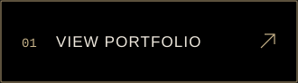
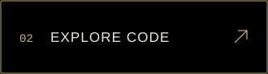

<!-- Upload this README.md and the complete assets folder together. -->

  <picture>
    <source
      media="(prefers-reduced-motion: reduce) and (max-width: 600px)"
      srcset="./assets/profile-mobile-static.svg"
    />
    <source
      media="(prefers-reduced-motion: reduce)"
      srcset="./assets/profile-static.svg"
    />
    <source
      media="(max-width: 600px)"
      srcset="./assets/profile-mobile.svg"
    />
    
  </picture>

   

  
  
  

 

About me, technology stack and contact details

### M. Waleed Akhtar Awan

**Full Stack Engineer · Atlas Nexus Corps**

I build full stack web applications and scalable systems, with a focus on
clean, performant and secure code.

### Technology stack

| Area | Technologies |
| :--- | :--- |
| Frontend | HTML, CSS, JavaScript, TypeScript, React, Next.js, Tailwind CSS |
| Backend | Node.js, Express |
| Databases | MongoDB, PostgreSQL |
| Development and deployment | Git, Docker, Linux |

### Engineering philosophy

> If it isn't automated, it isn't finished.

### Find me

[Portfolio](https://muhammadwaleedmalik.github.io/MyPortfolio/)
· [GitHub](https://github.com/MuhammadWaleedMalik)
· [Email](mailto:muhammadwaleedakhtar240@gmail.com)

